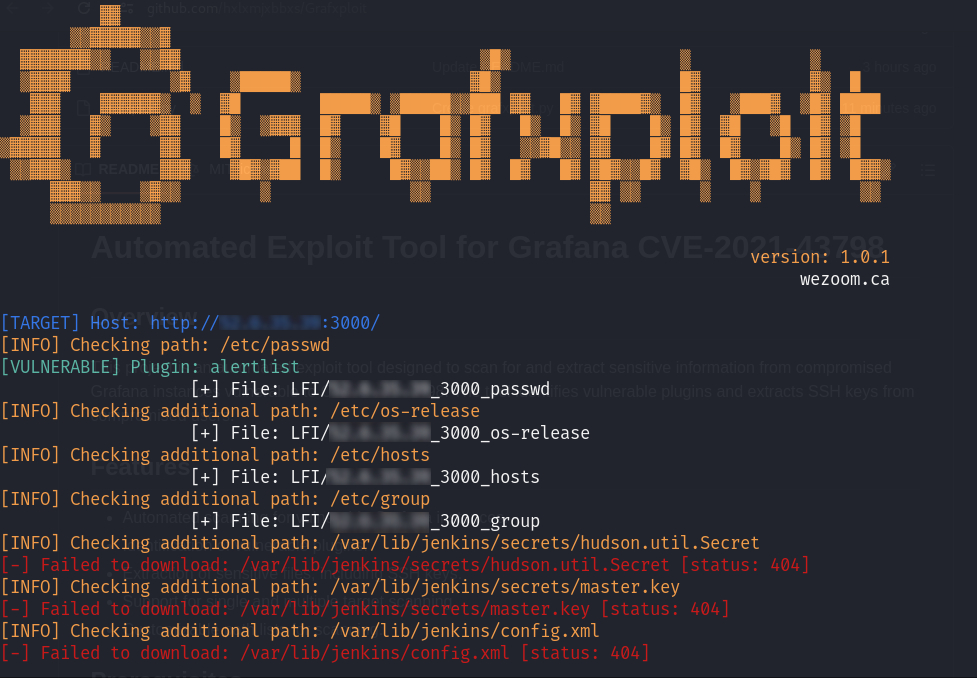

# Automated Exploit Tool for Grafana CVE-2021-43798


## Overview

This project is an automated exploit tool designed to scan for and extract sensitive information from compromised Grafana instances vulnerable to CVE-2021-43798. The tool identifies vulnerable plugins and extracts SSH keys from compromised users.

## Features

- Automated scanning for vulnerable Grafana instances.
- Identification of vulnerable plugins.
- Extraction of sensitive files, including SSH keys.
- Support for single and multiple target scanning.
- Customizable path lists for scanning.

## Prerequisites

- Python 3.x
- Required Python libraries: `colorama`

## Installation

1. Clone the repository:
    ```sh
    git clone https://github.com/hxlxmjxbbxs/grafxploit.git
    cd grafxploit
    ```

2. Install the required Python library:
    ```sh
    pip install colorama
    ```

## Usage

The tool can be run with various command-line options to specify targets, output directories, and additional paths to scan.

### Command-Line Options

- `-t`, `--target`: Check a single target in the format `proto://ip:port`.
- `-i`, `--input-targets`: Check multiple targets from a file in the format `proto://ip:port`.
- `-o`, `--output`: Directory to download the files if found.
- `-p`, `--paths`: File containing additional paths to check (default: `common/paths.txt`).

### Examples

1. Scan a single target:
    ```sh
    python grafxploit.py -t http://192.168.1.100:3000
    ```

2. Scan multiple targets from a file:
    ```sh
    python grafxploit.py -i targets.txt
    ```

3. Specify an output directory for downloaded files:
    ```sh
    python grafxploit.py -t http://192.168.1.100:3000 -o output_directory
    ```

## Developed by

- Halim Jabbes
- Mohammed Jalal Mahjoubi
- Fazil Kabkoubi
- Khodia Gueye

## Created On

22-03-2025
